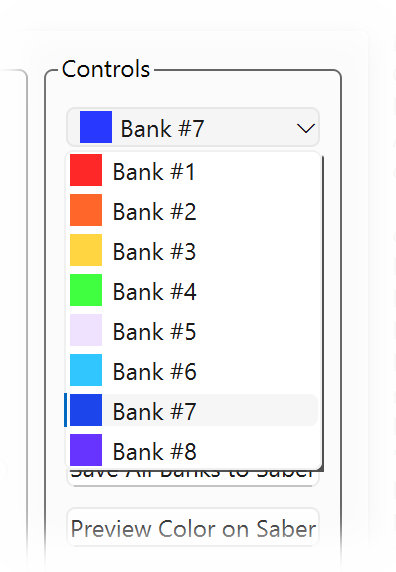

# Selecting a Color Bank

{align=right}

Your Anima stores seven sets of colors which you can choose from when your saber is activated. Each set is referred to as a *"color bank"*.

The **Color Bank Selector** lets you choose which bank is currently active for viewing and editing. Click the drop-down to display a list of color banks, along with a prievew of the main color currently set for that bank.

Click on the color bank you want to view or edit. Tintallë will load the color tab selectors and previews for the chosen bank into the [color interface](overview.md).

If you [save your settings to the Anima](saving.md), this will also set the selected bank as the *active bank*, the one that will be chosen when you next turn your saber on!