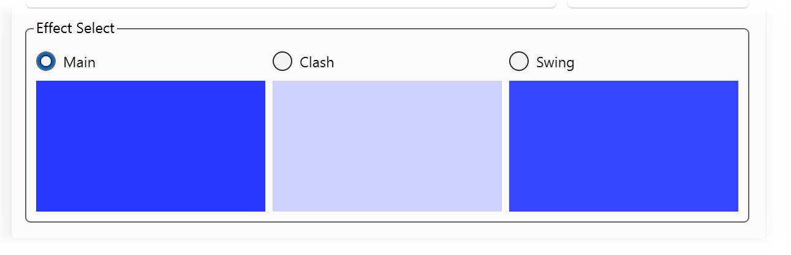

# Selecting an Effect

Your Anima can store separate color values for each of three effects: main color, clash color, and swing color. Tintallë lets you select which effect to edit using the Effect Selectors.

!!! question "Effect Meangings"
    - **Main**: The color of the blade when you are not moving your saber.
    - **Clash**: The color of the blade when you hit something or your saber is hit.
    - **Swing**: The color of the blade when you move your saber freely.

To choose an effect, click the radio button next to the effect you want to view or edit. Tintallë will update the color display to show the current values for the selected effect.