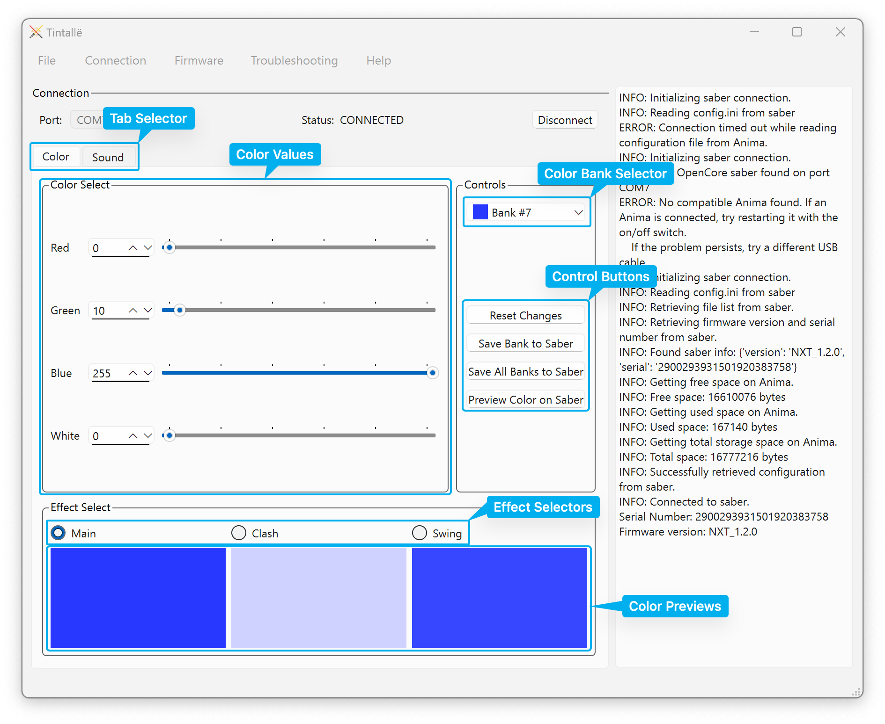

# Color Tab Overview

The image below illustrates the major parts of the Tintallë color management interface.

- **Tab Selector**: Changes between the Color and Sound interfaces.
- **Color Values**: Used to [adjust the values for each color componen](colors.md).
- **Color Bank Selector**: [Chooses which color set ("bank")](banks.md) to view or edit.
- **Control Buttons**: Perform various functions related to [saving](saving.md) and [previewing](colors.md#previewing-the-color-on-the-saber) color settings.
- **Effect Selectors**: [Chooses which effect](effects.md) you are currently editing.
- **Color Previews**: Shows an [approximation of the selected color](colors.md#setting-color-values) for the values set.