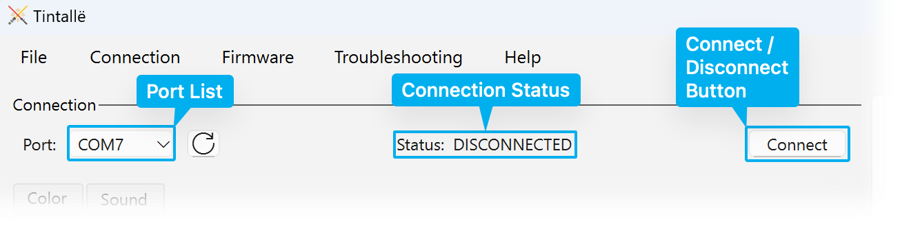

# Connecting to an Anima

After Tintallë has [found connected Animas](searching.md), you must connect to a specific Anima to use Tintallë's other features.

## The Connection Area

The Connection area at the top of Tintallë's main window shows the connection status and allows you to connect or disconnect from an attached Anima.

## Connecting to an Anima

!!! tip inline end
    If no Anima was found, see [Searching for Animas](searching.md).

To connect to an Anima:

- Select the Anima port from the **Port** drop-down list.
- Click the **Connect** button.

Tintallë will connect to the Anima and read its configuration.

## Disconnecting from an Anima

To disconnect from an Anima:

- Click the **Disconnect** button.

!!! failure "Do Not Turn Off or Disconnect the Cable"
    Always click the **Disconnect** button before turning off your Anima or removing the cable. Failure to properly disconnect could result in unsaved changes or unpredictable behavior for your Anima.

## Reloading the Configuration

To reload the last saved configuration from the Anima, do any of the following:

- From the menu bar, click **Connection :material-arrow-right-thin: Reload Config**.
- Click the **Reset Changes** button on the Color or Sound tab.

!!! warning
    This will discard any unsaved changes and reload the saved configuration from the Anima.