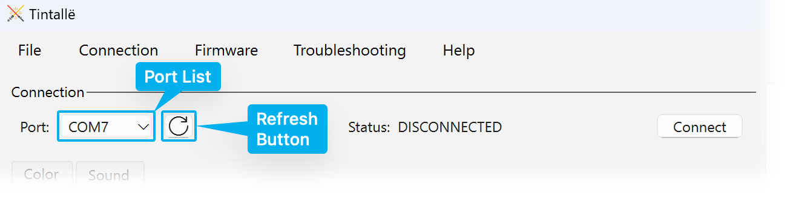

# Searching for Animas

Tintallë will automatically search for any attached saber Animas when it starts. The **Ports** dropdown box will display a list of ports where Tintallë found connected Animas.

!!! question "What is a Port?"
    "Port" or "COM port" refers to an internal address that your computer uses to identify and communicate with connected devices. On Windows, these will usually be in the form of `COM#` (`COM1`, `COM2`, etc..). For macOS, these will usually be `/dev/cu.usbmodem###`; for Linux, `/dev/ttyS#`.

To refresh the list of ports, do any of the following:

- Click the **Refresh (:material-refresh:)** button.
- Use the menu bar: **Connection :material-arrow-right-thin: Refresh Ports**
- Press ++ctrl+r++ (Windows/Linux) / ++cmd+r++ (macOS)