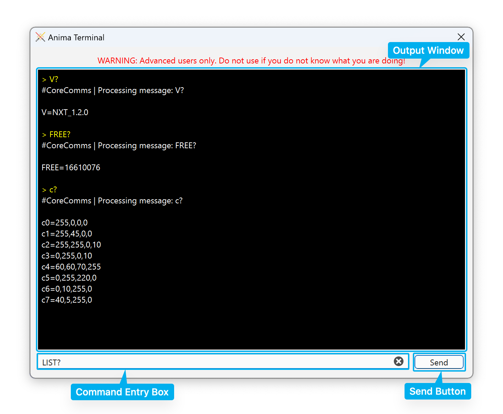

# Anima Terminal

!!! danger inline end "For Advanced Users Only!"
    This feature is only for advanced users. If you do not have a reason to use this, you probably should not.

The Anima Terminal feature lets you send commands raw commands directly to your Anima over the serial connection.

## Accessing the Anima Terminal

The Anima Terminal is only available after you have already [connected to an Anima](connecting.md). You can open the Anima Terminal from the drop-down menu: select **Connection :material-arrow-right-thin: Anima Terminal**.

## Using the Anima Terminal

The Anima Terminal sends entered commands to the Anima and displays the output.

Enter a command in the **Commmand Entry Box**. Click the **Send** button or press ++enter++ to send the command.

The **Output Window** will echo the sent command in yellow text. Any response from the Anima will appear in white.

!!! note
    You will not be able to access any other features of Tintallë while the Anima Terminal is open. This is by design, to ensure that no other features attempt to use the serial connection at the same time.

When you are finished, close the Anima Terminal window. Tintallë will automatically [reload the configuration from the Anima](http://127.0.0.1:8000/general/connecting.html#reloading-the-configuration) in case you made any manual changes.

## Command Syntax

The list of available commands and their values are specified in the [OpenCore COMMS Protocol](https://github.com/LamaDiLuce/polaris-opencore/blob/master/Documentation/COMMS-PROTOCOL.md).