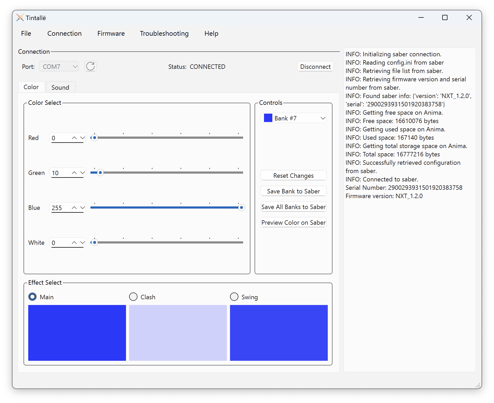

# Welcome to Tintallë

## What is Tintallë?

Tintallë is a software application for configuring lightsabers built on Anima cores from [Lama di Luce](https://www.lamadiluce.it/). Tintallë supports both the Anima EVO and Anima NXT models; for older Animas, see this page.

Tintallë is:

- :material-source-repository: ***Open source.*** Anyone can view or contribute to the [application source code](https://github.com/jramboz/tintalle), including this documentation!

- :material-language-python: ***Cross-platform.*** Built on a core of [Python](https://www.python.org/) and [Qt/PySide](https://wiki.qt.io/Qt_for_Python), Tintallë runs on Windows, Mac, and Linux.
- :material-party-popper: ***Intuitive, easy-to-use, and fun.*** Or at least, I hope it is!

!!! question "Why Tintallë?"
    The original Anima saber management software is named [Gilthoniel](https://github.com/Nuntis-Spayz/gilthoniel), which means "star-kindler" in [Sindarin](https://www.glyphweb.com/arda/s/sindarin.html). Since my software owes a huge debt to Gilthoniel, I named mine Tintallë, which has the same meaning in [Quenya](https://www.glyphweb.com/arda/q/quenya.html).

## Key Features

- Customize blade color banks
- Save and load color presets
- Upload sound fonts
- Update Anima firmware
- Reset Anima back to stock configuration
- Automatic light or dark mode, based on your ~~Force alignment~~ system preferences

## About Tintallë
{style="width:150px", align=right}
Tintallë is written and maintained by [Jason "Hawkeye" Ramboz](https://github.com/jramboz). He looks just like his GitHub user picture. 

<a href="https://www.flaticon.com/free-icons/lightsaber" title="lightsaber icons">Lightsaber icons created by Nhor Phai - Flaticon</a>

This program is free software: you can redistribute it and/or modify it under the terms of the [GNU General Public License](https://www.gnu.org/licenses/) as published by the Free Software Foundation, either version 3 of the License, or (at your option) any later version.