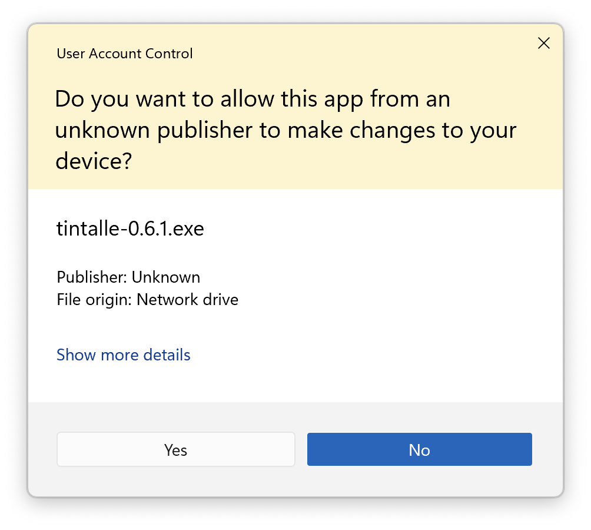
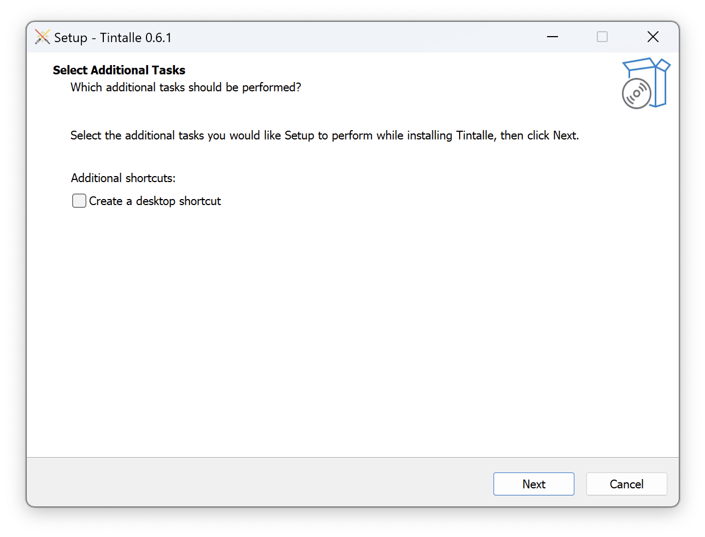
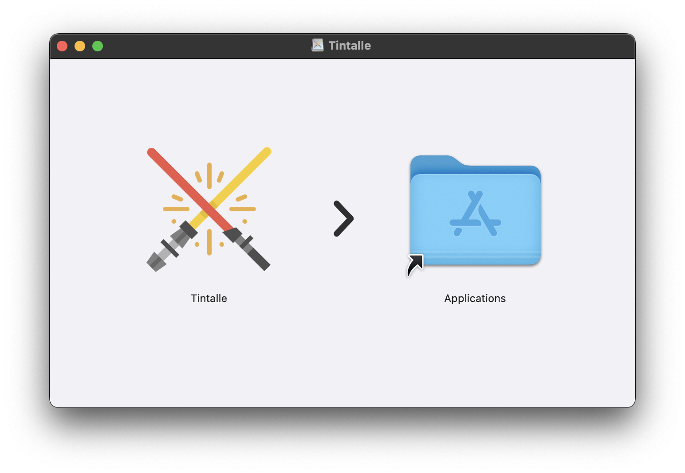

# Installing Tintallë

Tintallë can be installed on Windows, macOS, Linux, or (theoretically) any operating system that supports Python, Qt, and serial communications via USB.

## Windows Installation

Download the Windows installer from the [latest release page](https://github.com/jramboz/tintalle/releases/latest).

Run the installer. If you are prompted to allow changes, click **"Yes."**



Follow the prompts to finish the installation process.



Launch Tintallë from the Start Menu (or Desktop icon, if you chose to create one.)

## macOS Installation

Download the macOS .dmg file from the [latest release page](https://github.com/jramboz/tintalle/releases/latest).

Double-click the .dmg file to mount it.



Drag the **Tintallë** icon onto the **Applications** icon.

Launch Tintallë from the Launchpad, Applications folder, or Spotlight Search.

## Linux / Other OS Installation From Source

!!! warning "Command Line Ahead!"
    Installing from source requires use of the command line interface. If you're not familiar with the basics of command line operation, [here is a very good tutorial](https://ubuntu.com/tutorials/command-line-for-beginners#1-overview) to get you started.

### Prerequisites

Install the following prerequisites. You can do this via your system's package manager (e.g., `apt`, `yum`, `apk`) or build them from source:

- [Git](https://git-scm.com/)
- [Python](https://www.python.org/) 3.10 or later (3.13 preferred)
- [Qt6](https://www.qt.io/product/qt6) and `libqt6core6t64`

### Clone the GitHub Repository

Open a command line and enter the following command:

```
git clone https://github.com/jramboz/tintalle.git
```

This will copy the source files from GitHub to your computer.

### Install the Python Requirements

At the command line, enter the following commands:

```
cd tintalle/
pip install -r requirements.txt
```

!!! tip
    If you are already familiar with Python, I recommend creating a [virtual environment](https://www.geeksforgeeks.org/python-virtual-environment/) for Tintallë. If you don't know what this means, or you don't regularly use Python, you're probably okay to skip this.

### Run `app.py`

From the command line, enter this command:

```
python3 app.py
```

This will launch Tintallë! You can also install a shortcut to run this in the future. Please refer to your system's documentation for details.

!!! warning
    If you launch Tintallë from a terminal (command line) window, do not close the terminal window until you are finished using Tintallë! Closing the terminal window will also close Tintallë.