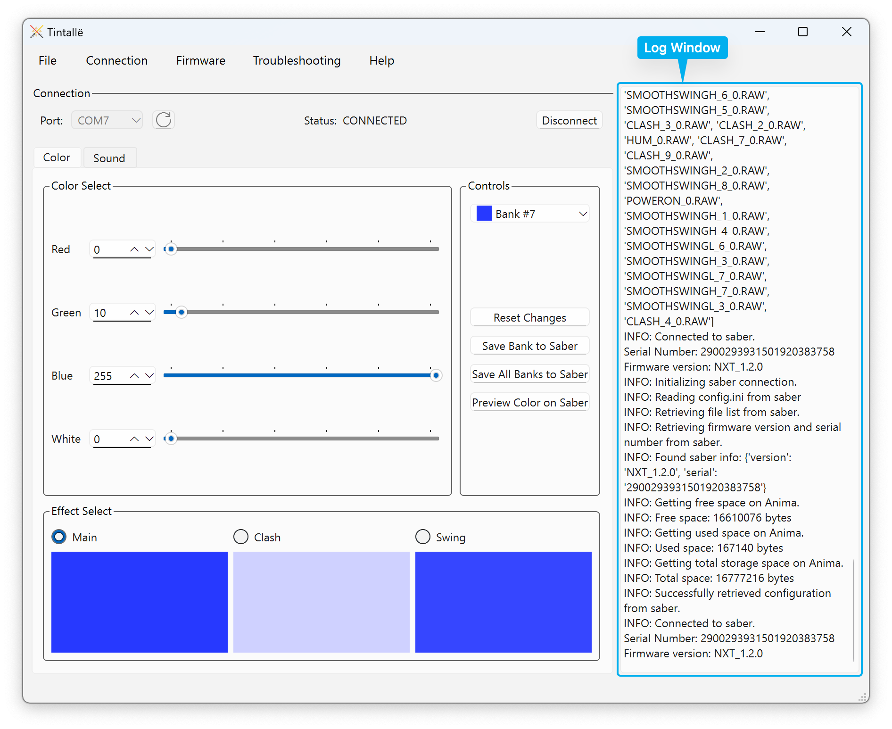

# The Log Window

The Log Window shows detailed information about how Tintallë is working with your Anima. This information can be useful for locating and identifying issues, or for providing more information when [getting help](gettinghelp.md).

## Showing and Hiding the Log Window

By default, Tintallë will display the Log Window when it opens. You can hide or show the Log Window by either:

- Use the menu bar: **Troubleshooting :material-arrow-right-thin: Show/Hide Log**
- Press ++ctrl+l++ (Windows/Linux) / ++cmd+l++ (macOS)

!!! tip
    Hiding the Log Window does just that -- makes it hidden! It's still there in the background, and it doesn't get erased. You can always show it again and scroll back if you need to.

## Debug Mode

In Debug Mode, Tintallë outputs additional information to the log. This can be very verbose, but can also be helpful for tracking down problems!

To toggle Debug Mode on or off, you can either:

- Use the menu bar: **Troubleshooting :material-arrow-right-thin: Debug Mode**
- Press ++ctrl+d++ (Windows/Linux) / ++cmd+d++ (macOS)

!!! note
    Enabling and disabling Debug Mode only applies to messages written to the log after you toggle the setting. Older messages written to the log will not change.

## Saving the Log to a File

You can save the entire output of the log window to a text file on your computer. This can be useful for sending to others when [seeking help](gettinghelp.md), or when you want to examine the log at a later time.

To save the current log to a file, use the menu bar: **Troubleshooting :material-arrow-right-thin: Save Log to File...**

You will be prompted for the location and filename to save to.
