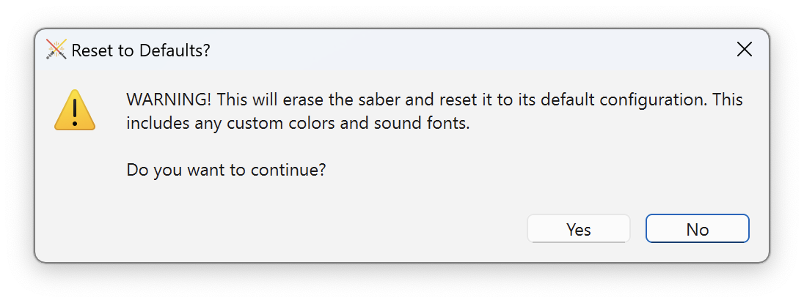

# Resetting Anima to Defaults

Tintallë can automatically restore your Anima to its default settings and sound font.

!!! warning
    This process cannot be reversed. All custom sounds and configuration on your Anima will be lost.

To reset your Anima to defaults, from the menu bar select **Troubleshooting :material-arrow-right-thin: Reset Saber to Defaults**.

Tintallë will prompt you to confirm that you want to do this.

If you proceed, Tintallë will automatically perform the following steps:

1. Erase all files on the Anima.
2. Upload the default sound font.
3. Issue the `RESET` and `SAVE` commands to the Anima.
4. Disconnect and reconnect your Anima.

!!! warning
    Do not turn off or disconnect your Anima or your computer until this process is complete!